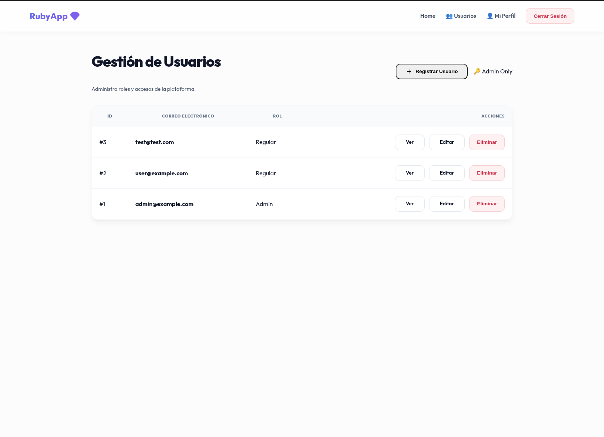

# 💎 Premium User Management System (Rails 8)

[](https://rubyonrails.org/)
[](https://www.ruby-lang.org/)
[](https://opensource.org/licenses/MIT)

## 📸 Vista de la Aplicación (Preview)



Un sistema profesional de gestión de usuarios (User CRUD) desarrollado con las últimas convenciones de **Ruby on Rails 8**. Este proyecto implementa un sistema de autenticación nativo, Control de Acceso Basado en Roles (RBAC) y una interfaz de usuario premium con estética moderna.

---

## 🚀 Características Principales (Features)

- **🛡️ Autenticación de Vanguardia:** Implementación nativa de Rails 8 para manejo de sesiones seguras.
- **🔑 Roles & Permisos (RBAC):**
  - **Admin:** Gestión total de la plataforma (Listar, Crear vía Modal, Editar y Eliminar usuarios).
  - **Regular:** Acceso exclusivo a la visualización y edición de su propio perfil.
- **✨ Interfaz Premium V2:**
  - Diseño **Glassmorphism** y tipografía especializada (*Outfit*).
  - Notificaciones tipo **Sonner/Toast** con animaciones fluidas.
  - Experiencia de usuario optimizada mediante **Modales (HTML5 Dialog)** y **Turbo Frames**.
- **📱 Totalmente Responsivo:** Adaptado para una visualización impecable en dispositivos móviles, tablets y escritorio.
- **🧹 Arquitectura Limpia:** Siguiendo estrictamente el patrón MVC y las convenciones de "Convention over Configuration".

---

## 🛠️ Tecnologías Utilizadas

- **Core:** Ruby on Rails 8.1.3
- **Base de Datos:** SQLite3 (Desarrollo/Test)
- **Frontend:** Turbo, Stimulus, Vanilla CSS (Premium Design System)
- **Seguridad:** BCrypt para hashing de contraseñas, RBAC Logic

---

## 📋 Requisitos e Instalación

1.  **Clonar el repositorio:**
    ```bash
    git clone https://github.com/Pablituuu/ruby-user-crud.git
    cd ruby-user-crud
    ```

2.  **Instalar dependencias:**
    ```bash
    bundle install
    ```

3.  **Preparar la base de datos:**
    ```bash
    bin/rails db:prepare
    bin/rails db:seed
    ```

4.  **Iniciar el servidor:**
    ```bash
    bin/rails server
    ```

> [!IMPORTANT]
> **Credenciales de prueba (Seeds):**
> - **Admin:** `admin@example.com` / `password123`
> - **User:** `user@example.com` / `password123`

---

## 🧔 Sobre el Autor

### **Pablito Jean Pool Silva Inca**
**Ingeniero de Sistemas e Informática** 💻☕

Ingeniero apasionado por la tecnología con más de 6 años de experiencia trabajando con herramientas de ciberseguridad (XDR) y desarrollo de software. Enfocado en soluciones escalables y seguras.

- **🌐 Portafolio:** [pablituuu.space](https://pablituuu.space)
- **🔗 LinkedIn:** [pablito-jean-pool-silva-inca](https://www.linkedin.com/in/pablito-jean-pool-silva-inca-735a03192/)
- **📧 Email:** [pablito.silvainca@gmail.com](mailto:pablito.silvainca@gmail.com)
- **📍 Ubicación:** Perú 🇵🇪

---

## ⚖️ Licencia

Este proyecto está bajo la licencia MIT. Siéntete libre de usarlo, modificarlo y distribuirlo para tus propios proyectos.
